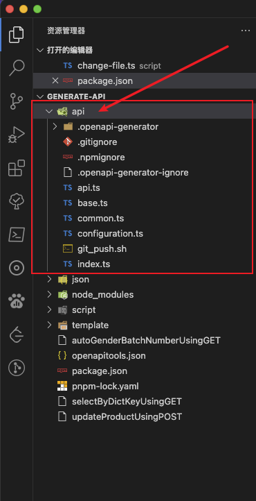
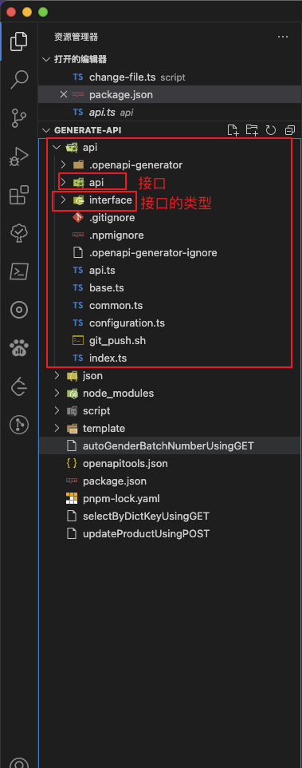

# OpenAPI Generator

## 1.安装

npm全局安装

```shell
npm install @openapitools/openapi-generator-cli -g
```

在项目中应用

```shell
npm install @openapitools/openapi-generator-cli -D
```

## 2.使用

查看使用帮助

```shell
npx openapi-generator-cli help
```

| 命令        | 说明                                        |
| ----------- | ------------------------------------------- |
| generate    | Generate code with the specified generator. |
| config-help | Config help for chosen lang                 |
| list        | Lists the available generators              |
| version     | Show version information used in tooling    |
| ...         | ...                                         |

查看生成接口帮助

```shell
npx openapi-generator-cli help generate
```

| 命令                        | 说明                                                         |
| --------------------------- | ------------------------------------------------------------ |
| -c \| --config              | 配置文件路径                                                 |
| -g \| --generator-name      | 选择生成器名字                                               |
| -e \| --engine              | 选择使用哪种模版引擎生成( 默认使用 `mustache模版` )          |
| -i \| --input-spec          | 接口文件的地址( 可以是 `json文件` ,也可以是 `yaml文件` , 也可以是一个url  ) |
| -o \| --output              | 输出的接口文件路径                                           |
| -p \|--additional-propertie | 附加属性。以-p=name=value,name=value,...的形式进行展示       |
| -t \| --template-dir        | 模版所在路径( 默认使用`mustache模版` )                       |
| ...                         | ...                                                          |

基本使用

```shell
npx openapi-generator-cli generate -i ./json/api.json -g typescript-axios -o ./api/
```



生成完成后，接口和类型都会放在 `api文件` 中，看起来会很怪。


按照接口和类型进行区分(使用-p|--additional-propertie, 具体参数看[链接](https://openapi-generator.tech/docs/generators/typescript-axios))

```shell
npx openapi-generator-cli generate -i ./json/api.json -g typescript-axios -p=withSeparateModelsAndApi=true,apiPackage=api,modelPackage=interface  -o ./api/
```



使用配置文件生成接口

当使用 `npx openapi-generator-cli ` 时，会在运行脚本的所在目录生成一个`openapitools.json`的配置文件

```json
{
  "$schema": "./node_modules/@openapitools/openapi-generator-cli/config.schema.json",
  "spaces": 2,
  "generator-cli": {
    "version": "6.6.0"
  }
}
```

然后通过修改配置文件自定义自己想要的配置的生成器

```json
{
    "$schema": "./node_modules/@openapitools/openapi-generator-cli/config.schema.json",
    "spaces": 2,
    "generator-cli": {
        "version": "6.6.0",
        "generators": {
            "v2.0": {
                "generatorName": "typescript-axios",
                "output": "./api",
                "inputSpec": "./json/api.json",
                "templateDir": "./template",
                "additionalProperties": {
                    "apiPackage": "api",
                    "modelPackage": "interface",
                    "withSeparateModelsAndApi": true,
                    "withInterfaces": true,
                    "supportsES6": true
                }
            }
        }
    }
}

```

`--generator-key` 就是配置文件中 `generators` 对象中的某一个key，`generators`可以自定义多个配置，用来符合多种场景

运行脚本:

```shell
npx openapi-generator-cli generate -c ./openapitools.json --generator-key v2.0
```


忽略某些文件的自动生成(对第一次生成最有用)

在生成代码的根目录下创建 `.openapi-generator-ignore` 文件，用法和 `.gitignore` 文件一样。然后再运行脚本。


## 3.mustache模版语法

- {{keyName}}
- {{{keyName}}}
- {{#keyName}} {{/keyName}}
- {{^keyName}} {{/keyName}}
- {{.}}
- {{!comments}}
- {{>partials}}

1. {{keyName}}简单的变量替换。
2. {{{keyName}}} 如果keyName的值中有一些特殊字符，{{keyName}}会将一些特殊字符进行转码，使用{{{keyName}}}就可以进行原样输出。
3. {{#keyName}} {{/keyName}}以#开始、以/结束表示区块，它会根据当前上下文中的键值来对区块进行一次或多次渲染。它的功能很强大，有类似if、foreach的功能。
4. {{^keyName}} {{/keyName}}该语法与{{#keyName}} {{/keyName}}类似，不同在于它是当keyName值为null, undefined, false时才渲染输出该区块内容。
5. {{.}} {{.}}表示枚举，可以循环输出整个数组
6. {{! }}表示注释
7. {{>partials}}以>开始表示子模块，当结构比较复杂时，我们可以使用该语法将复杂的结构拆分成几个小的子模块。
